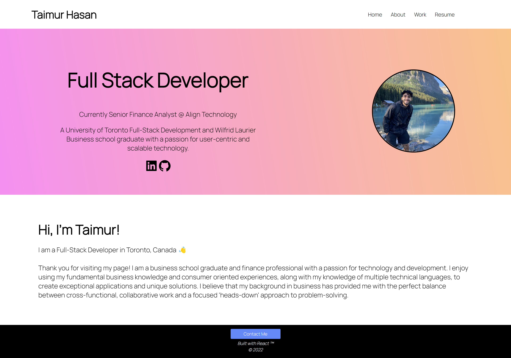

# Description

Note: This project was bootstrapped with [Create React App](https://github.com/facebook/create-react-app).

Welcome to the repository for my official portfolio, proudly built with React.js! Here you will find the latest and greatest details on my current adventures, my background and story, and my favorite projects.  

 
 

**Languages and Technologies Used:** 
- JavaScript ES6
- React.js
- CSS
- HTML
- Webpack

## Live Deployment

To access my portfolio, click [here](https://taimurhasan.github.io/taimurhasandev/).

## License
This project is licensed under the MIT License - see the [license info](https://opensource.org/licenses/MIT) for details.

## Questions

[GitHub](https://github.com/TaimurHasan)  
For any questions, please send an Email to [taimurhasan11@gmail.com](mailto:taimurhasan11@gmail.com)